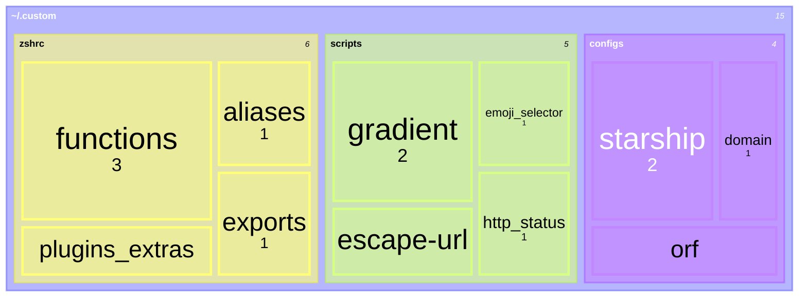

# Personalised Workspace Configuration

> [!IMPORTANT]
> This should be cloned into your home directory
>
> It has a gitignore configured to work in `~`

## What is this?

This is a modular, composition-based zsh configuration inspired by [this fantastic article](https://afridi.dev/articles/organize-your-zsh-configurations-and-plugins/), and taken a little bit further

### Layout

## What do I need to use it?

For this setup, I've made sure it's extra light and minimal

**Make sure you have [oh-my-zsh](https://ohmyz.sh/) 😺**

### Prompt Customisation

- [starship](https://starship.rs/)

### Zsh Plugins

- zsh-syntax-highlighting
- zsh-autosuggestions
- zsh-history-substring-search

### CLI Tools

Some [functions](.custom/zshrc/functions.zsh) and one [alias](.custom/zshrc/aliases.zsh) use the below here and there for now

- [eza](https://github.com/eza-community/eza)
- [jq](https://github.com/jqlang/jq)
- [nushell](https://www.nushell.sh/) (as a subshell for pretty printing data structures)

## Mentions

I'd like to give credit to [this useful list of scripts](https://evanhahn.com/scripts-i-wrote-that-i-use-all-the-time/) for [emoji](.custom/scripts/emoji-selector.sh) and [http status](.custom/scripts/http-status.sh)